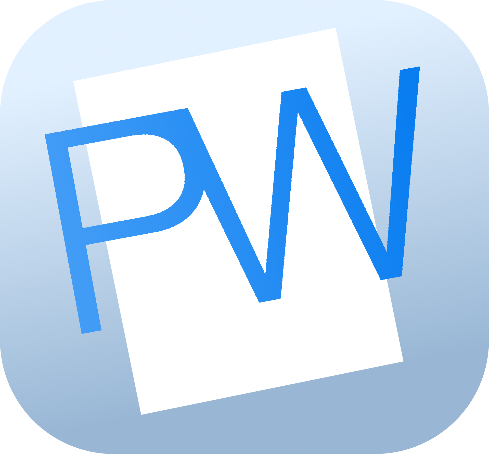

# OODProject - PhonetikWrite

Project for Object Oriented Design, Spring 2021
Prof. Rakeshkumar Shukla

&nbsp;&nbsp;Do you or anyone you know suffer from dyslexia, dysgraphia, or another type of learning disability that makes spelling extremely difficult? Odds are you probably do. LDonline.org, a non-profit organization dedicated to helping children and adults with learning disabilities, estimates that 5 to 15 percent of Americans alone suffer from dyslexia. That’s 14.5 - 43.5 million people! While there have been steps towards aiding people afflicted with these sorts of disorders, they still struggle with their daily lives. That is why, we would like to propose the idea of Projekt Phonetik Spelling.
&nbsp;&nbsp;The goal of this project is to create a simple word processor that is useful for those with various disabilities who struggle with English spelling. The software would function similar to a lightweight version of Word, but users could input words with a phonetic spelling and the software would replace it with the proper English spelling. For example: “kats r smol” could be replaced by “cats are small.” This will make typing easier for those with learning disabilities that affect their ability to spell. By implementing the phonetic spelling software, the disabled will be assisted tremendously with making their work easier to complete.

# Using
- Install python3.8.9
- Using that python installation, run `sudo -H python3 -m pip install -r requirements.txt`
- Ensure tkinter comes with your python installation.
- Run `python3 test.py` 
